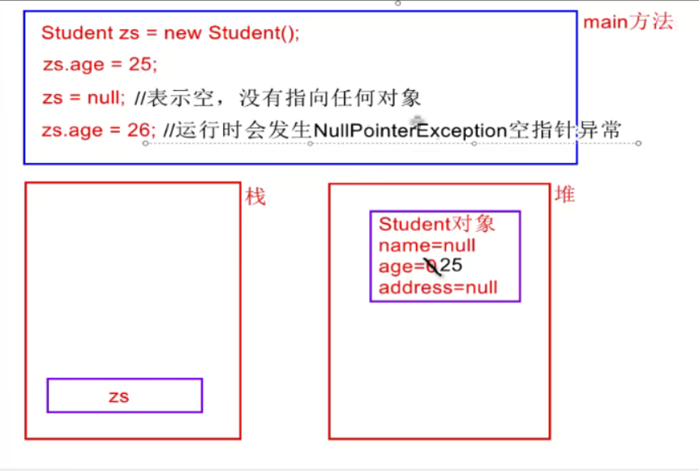
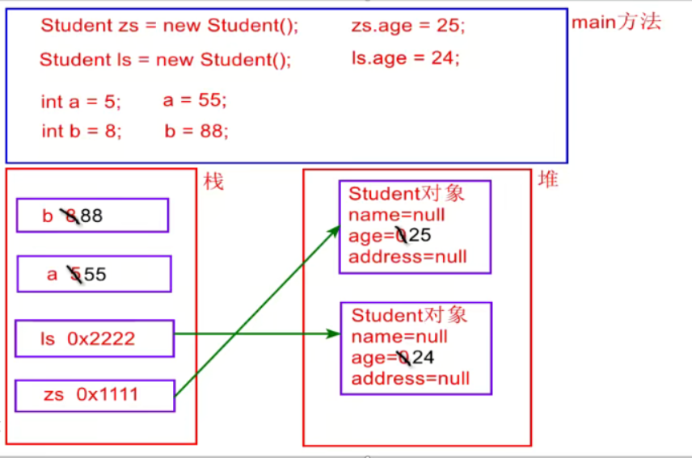

##### 方法的签名：

方法名+参数列表

```
class Aoo(){
	void show(){}
	void show(){}//不允许出现相同名字的
	void show(String name){}
	//允许名字一样，但是参数列表不一样，这是方法的重载
}
```

##### 方法的重载（overloa/overloadi）：

在用一个类中方法名一样，参数列表不同   

好处：方便用户的调用，系统会自动匹配哪个无参哪个有参d

```Java
例子：
System.out.println();
System.out.println(123);
System.out.println("你好");
System.out.println(‘a’);
System.out.println(12.35);
System.out.println(true);
方法重载，系统调用自动配套
```

代码解释：

```Java
void show(){}
void show(String name){System.out.println(name);}
void show (int age){System.out.println(age);}
void show (String name,int age){System.out.println(name+age);}
void show (int age,String name){System.out.println(age+name);}
//int show (){return 1;}//重载与返回值类型无关
//void show(String address){}//重载与参数名称无关
```

```java
Aoo o=new Aoo();
o.show();
o.show("wjw");
o.show(18);
o.show(18,"wjw");
o.show("wjw",18);
}
```


##### 构造方法：

构造函数，构造器，构建器

> 给成员变量赋初始值
>
> 与类同名，没有返回值类型（连void都没有）
>
> 在创建（new）对象时被自动调用
>
> 若自己不写构造方法，则编译器默认提供一个无参构造方法
>
> 若直接写了构造方法，则不再默认提供
>
> 构造方法可以重载

```java
class Student{
	String name;
	int age;
	String address;
	//给变量赋初始值
	Student(String name1,int age1,String address1){//与类名同名，如果没有返回值连void都不用
	name=name1;
	age=age1;
	address=address1;
	}
}

```


##### this：

指代当前对象，哪个对象调用方法它指的是哪个对象

只能用在方法中，在方法中访问成员变量之前默认有一个this

用法：

this.成员变量-----------------------访问成员变量

> 成员变量与局部变量同名时候，若想访问成员变量，this不能省略

this.方法名（）--------------------调用方法（一般不用）

this.()----------------------------------调用构造方法(一般不用)

```java
       	Student zs=new Student();
        zs.name="zhangsan";
        zs.age=22;
        zs.address="福建福州";
        zs.study();//zs.name
        zs.sayHi();//zs.name,zs.age,zs.address


class Student {//class关键字
    //成员变量
    String name;
    int age;
    String address;
    //方法
    void study(){///this只能在方法中使用
        System.out.println(this.name+"在学习....");
    }
    void sayHi(){
        System.out.println("大家好，我叫"+this.name+",今年"+this.age+"家住在："+this.address);
    }

}
```

用法：

在java中规定，成员变量和局部变量是可以同名的

>		​		使用时默认采取得到是就近原则
>	
>		​		若想访问成员变量时，this不能省略

​	

```java
Student zs=new Student();

class Student {//class关键字
    //成员变量（整个类）
    String name;
    int age;
    String address;
    //构造方法
    Student(String name,int age,String address){
    //局部变量int a=5;//只能在当前方法中使用
    	this.name=name;
        //this.name为成员变量，将局部变量赋值给成员变量
    	this.age=age;
    	this.address=address;
    }
    //方法
    void study(){///this只能在方法中使用
        System.out.println(this.name+"在学习....");
    }
    void sayHi(){
        System.out.println("大家好，我叫"+this.name+",今年"+this.age+"家住在："+this.address);
    }

}
```

```
class Student {//class关键字
    //成员变量（整个类）
    String name;
    int age;
    String address;
    //构造方法
    Student(){
    	this("wjw"，1，"weizhi")
    }
    Student(String name,int age,String address){
    //局部变量int a=5;//只能在当前方法中使用
    	this.name=name;
        //this.name为成员变量，将局部变量赋值给成员变量
    	this.age=age;
    	this.address=address;
    }
```

##### null和NullPointerException

内存管理：

由jvm进行管理的----java虚拟机

1.堆：new出来的对象（包括成员变量）

2.栈：局部变量（包括方法的参数）

3.方法区：------面向对象第五天讲




